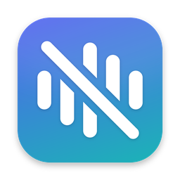

# Over&Out

> Formerly *Hush*. Renamed because Homebrew already has an unrelated app called `hush`.



A small macOS menu-bar app so you never have to wonder "am I muted?" or "is my video still playing?".
It notices when you step away, pick up your phone, or a call starts, and mutes, hides and pauses things
for you. When you're back, it puts everything the way it was.

| Situation | What Over&Out does | When it ends |
|---|---|---|
| **You walk away** during a meeting or while a video plays | Mutes the mic, turns Zoom video off, pauses the video or music | You sit back down: unmutes, turns video back on, resumes playback |
| **You put your phone to your ear** | Same as walking away | You put the phone down: everything comes back |
| **A call starts** (Zoom, Teams, Meet, FaceTime, Slack…) | Pauses whatever you were watching (optionally starts you muted) | Call ends: playback resumes |
| **An iPhone call rings on the Mac** | Pauses media and lowers the volume | You answer (volume comes back so you can hear) or it stops ringing |
| **Panic** `⌃⌥⌘P` | All of the above at once | Press again |
| **Mute toggle** `⌃⌥⌘M` | System-wide hard mute of every microphone | Press again, or the call ends |

## Keyboard shortcuts

| Shortcut | Does |
|---|---|
| `⌃⌥⌘H` | Open Over&Out's menu at the pointer (works even if a full menu bar hides the icon behind the notch) |
| `⌃⌥⌘G` | Turn Over&Out on/off (off = nothing automatic; everything it took is given back) |
| `⌃⌥⌘C` | Over&Out camera on/off (also ends a timed pause) |
| `⌃⌥⌘M` | Mute/unmute every microphone (works even when Over&Out is off) |
| `⌃⌥⌘P` | Panic mode on/off (works even when Over&Out is off) |

Timing: you count as away after **2 s** off camera (adjustable from 1 to 10 s in the menu), on the phone after
**1 s** with a hand at your ear, and back after **0.75 s** in view.

The menu-bar icon always shows the state: 🔴 red mic = you're live in a call, mic-slash = muted,
walking figure = away, phone = on the phone, waveform = watching, greyed slashed waveform = off.

## Over&Out camera on / off

Over&Out's use of the camera is yours to control, from the menu, Settings or the keyboard:

- **⌃⌥⌘C** or **Turn Over&Out Camera Off/On** in the menu: off stays off until you turn it back on.
- **Pause Over&Out Camera For** 15 min / 30 min / 1 hour / 2 hours: it switches back on by itself and tells you.
- The menu always shows its state: *off*, *paused until 3:45 PM*, *on, waits for a call or video*, or
  *watching (green light on)*.

With the camera off, everything else keeps working: call detection, pausing media when a call starts,
lower volume while ringing, and the mute and panic shortcuts. Only away and phone-at-ear detection stop.

## Updates, What's New, About

- **Settings → Updates** checks GitHub Releases (also daily in the background, with a notification),
  shows the release notes, and installs: through Homebrew when Over&Out was installed with it (Over&Out quits,
  updates and reopens by itself), otherwise by opening the download page.
- After an upgrade, Over&Out shows **What's New** once, from the bundled `CHANGELOG.md`.
- **Settings → About**: version, privacy summary, links and credits. Also in the menu as *About Over&Out*.
- Releases read their notes from `CHANGELOG.md`: add a `## <version>` section before `./scripts/release.sh`.

## Setup Assistant

On first launch Over&Out opens a checklist: Camera, Accessibility, Notifications, and each installed browser
(Chrome, Brave, Edge, Vivaldi, Arc, Safari; Firefox, Opera and Zen are listed as not controllable, since they
have no way for other apps to run JavaScript in a page). Every row shows its live status with a one-click fix. For browsers,
**Check** runs a harmless test (macOS asks once whether Over&Out may control the browser), and **Turn It On for
Me** ticks *Allow JavaScript from Apple Events* in the browser's own menu. Finishing with a browser ready turns
on browser control (Meet camera/mute buttons, pausing a video next to a meeting). Run it again any time from
the menu or Settings.

## Settings

Open **Settings…** from the menu (or open Over&Out again from Finder/Spotlight). Everything is a toggle there:
presence detection, "keep watching even with nothing playing", how quickly you count as away, phone
detection, what to mute/pause, call behaviour, ringing volume, notifications, open at login, plus the
shortcut list and a live permissions list.

On first launch a welcome card drops down under the menu-bar icon so you know it's installed; after
that, each launch shows a 3-second "Over&Out is running" toast.

**Camera Preview (Test Detection)…** in the menu shows the live camera with what Over&Out sees drawn on top:
your face (green), detected phones (red), hand points (orange), the verdict, its reason and the phone
confidence. Use it to check phone-at-ear detection in your lighting and seat.

**Testing detection:** turn on *Keep watching even with no call or video playing*, then open the menu:
the *Camera sees:* line shows what the latest frame was read as (you / no one / phone at your ear).

## How it works

- **Call detection** reads which apps are using the microphone via Core Audio (per-app on macOS 14.2+).
- **Presence** uses the built-in camera with Apple's Vision framework, on-device, about 4 frames a second:
  no face or body means you're away; a hand held beside your face (or a wrist raised to your ear) means you're on
  the phone. Frames are never saved. By default the camera only runs while you're in a call or something is
  playing, so the green light comes on only then.
- **Mic mute** is a hard mute on the microphone device itself, so it works in every app. Original levels
  are saved and put back, even after a crash.
- **Meeting camera & mute** are switched by pressing the meeting's own buttons through the Accessibility API
  (like VoiceOver): *Turn off camera* in Google Meet, *Turn camera off* in Teams, *Stop video* in Webex/Zoom,
  and so on, in any app or browser tab. Buttons only offer the change from the current state, so Over&Out never
  turns a camera on by mistake. When you're back it presses *Turn on camera*/*Unmute* only where it turned
  things off. Zoom's desktop app is driven through its Meeting menu.
- **Several things playing at once:** Spotify, Music, TV, VLC and QuickTime are each paused and resumed
  individually (AppleScript). With tab control on, *every* playing tab in Chrome, Brave, Edge, Vivaldi, Arc and
  Safari is paused and resumed too: all windows, desktops and screens, meeting tabs skipped. Anything else
  (Firefox, IINA…) gets the ⏯ key, which macOS delivers to only one app, the most recent player.
- **Media**: Spotify and Music are paused and resumed via AppleScript. Browsers, VLC, QuickTime and the TV
  app get the ⏯ media key, only when something is actually playing, with no setup needed.
  With **a video and a meeting in the same browser** (Netflix + Meet in Brave/Chrome) Over&Out reads the browser's
  tab bar, where tabs are labelled "… - Audio playing" or "… - Camera and microphone recording". If a
  non-meeting tab is playing it presses ⏯ (the video takes the media keys, Meet doesn't); if only the meeting
  is, it presses nothing, so a paused video is never resumed by mistake. No browser setting needed (English
  UI; elsewhere it falls back to "was the video playing before the call started"). Each time you step away it
  checks again, so a video you started during the call gets paused too.
- **Advanced, off by default:** *Settings → Advanced → Control meetings and videos inside browser tabs* lets Over&Out
  press Google Meet's camera/mute buttons and pause a video tab next to a meeting tab. It needs *Allow
  JavaScript from Apple Events* in that browser, a developer setting, so Over&Out never asks for it unless you
  switch this on. Without it, browser meetings still get the system-wide mic mute.

## Install with Homebrew

Over&Out needs macOS 13 (Ventura) or later. From version 1.1.13 one app runs natively on both
Apple Silicon and Intel Macs, so the command is the same; only where Homebrew lives differs.
Not sure which chip you have?  → Apple menu → **About This Mac** → "Chip" (Apple M1/M2/M3/M4…) or
"Processor" (Intel), or run `uname -m` (`arm64` = Apple Silicon, `x86_64` = Intel).

### Apple Silicon (M1, M2, M3, M4…)

```bash
# Homebrew, if you don't have it yet (installs to /opt/homebrew):
/bin/bash -c "$(curl -fsSL https://raw.githubusercontent.com/Homebrew/install/HEAD/install.sh)"
eval "$(/opt/homebrew/bin/brew shellenv)"

brew install --cask gokulmv/tap/over-and-out
```

### Intel

```bash
# Homebrew, if you don't have it yet (installs to /usr/local):
/bin/bash -c "$(curl -fsSL https://raw.githubusercontent.com/Homebrew/install/HEAD/install.sh)"

brew install --cask gokulmv/tap/over-and-out
```

Intel Macs need version 1.1.13 or later (earlier releases were Apple Silicon only). Phone detection uses
the smaller detector on Intel, which keeps up without a Neural Engine; everything else is the same.

### Update, remove, fix

```bash
brew update && brew upgrade --cask gokulmv/tap/over-and-out    # update (or: menu → Check for Updates)
brew uninstall --cask gokulmv/tap/over-and-out                  # remove (add --zap to delete its settings too)
brew install --cask --force gokulmv/tap/over-and-out            # "there is already an App at …": reinstall over it
```

The first launch opens the Setup Assistant, which asks for the permissions Over&Out needs.

### Publishing a release (maintainers)

```bash
brew install gh && gh auth login     # once
./scripts/setup-signing.sh           # once: stable signature, users keep permissions across updates
./scripts/release.sh 1.0.0
```

This builds Over&Out.app for Apple Silicon and Intel (with full Xcode, or with the Command Line Tools by
building each chip separately and joining them; the phone detectors aren't bundled, the app downloads them
from Apple on first launch), uploads `OverAndOut-1.0.0.zip` as a GitHub release, and writes `Casks/over-and-out.rb` into the tap repo
`GokulMV/homebrew-tap` (created on the first release). Over&Out isn't notarized yet, so the cask removes the
download quarantine after installing; notarizing needs an Apple Developer account.

## Build & install from source

Needs macOS 13+ and Xcode (or the Command Line Tools with Swift 5.9+).

```bash
git pull && ./scripts/install.sh
```

`install.sh` builds Over&Out, quits and deletes any installed copy (and the old CallGuard), clears Over&Out's stale
Accessibility entry (every build has a new signature, so the old ✓ silently stops working), copies the fresh
app to `/Applications` and launches it. Allow Accessibility again when asked.

To only build without installing: `./scripts/build-app.sh`.

Every push also builds the app on GitHub Actions: download **Over&Out.zip** from the run's artifacts.
The app is not notarized, so on first launch right-click it and choose **Open**
(or run `xattr -dr com.apple.quarantine "/Applications/Over&Out.app"`).

Grant when asked. The menu's **Permissions** submenu shows each one live (✅ allowed, ❌ denied,
⚪️ not asked yet); click a row to jump to its System Settings page.

| Permission | Why |
|---|---|
| Camera | See whether you're at your desk or on the phone |
| Accessibility | Control Zoom's mute/video and press the ⏯ key |
| Automation → Spotify / Music | Pause and resume them |
| Notifications | Tell you when it mutes you (optional) |
| Open at Login | Start with your Mac (optional) |

It never asks for Microphone or Screen Recording: it only checks *whether* the mic is in use and never listens.

Turn on **Open at Login** in Settings.

**Upgrading from CallGuard?** Over&Out is a new app ID. Remove the old app and its permission entries:

```bash
osascript -e 'quit app "CallGuard"'; rm -rf /Applications/CallGuard.app
tccutil reset All com.gokulmv.callguard
```

## Limits (honest list)

- **Meeting camera/mute needs a visible meeting tab.** Browsers only expose the active tab of each window, so
  keep the Meet tab in front within its window (the window itself can be behind others). An app with unlabeled
  buttons can't be controlled; the system-wide mic mute still silences you everywhere.
- **Phone detection uses Apple's Core ML YOLOv3 object detector** (the full model on Apple Silicon, the
  ~9 MB Tiny one on Intel). It isn't bundled: Over&Out downloads it from Apple by itself in the background on
  first launch (Tiny first, so detection starts within seconds, then the full model), and retries later if
  offline. Nothing to do for the user. It counts a *phone* seen in your hand or at your ear; a hand at your
  ear without a phone never counts. Camera Preview shows the detected phones (red boxes), their confidence
  and which model is in use.
- **Ringing detection** relies on macOS launching FaceTime when an iPhone call comes in (Continuity). If your
  iPhone isn't set up to ring on the Mac, only the phone-at-ear detection will catch the call.
- On **macOS 13 – 14.1** Core Audio can't say *which* app is playing sound, so media pausing mid-call is skipped
  there, and a headset that plays music may look like a mic in use.
- Rebuilding changes the ad-hoc code signature, so macOS may ask for Accessibility permission again.

## Development

```bash
swift build        # debug build
swift test         # unit tests for the decision logic
swift run          # runs without a bundle (no notifications, no login item)
python3 scripts/make-icon.py   # redraw Resources/AppIcon.icns (needs Pillow)
```

| File | Role |
|---|---|
| `OverAndOutEngine.swift` | Decides what to take away and when to give it back |
| `Ledger.swift` | Reference-counts reasons per resource, so walking away mid-call never resumes what the call paused |
| `PresenceSensor.swift` / `PresenceTracker.swift` | Camera + Vision, then debouncing into present / away / on-phone |
| `AudioDevices.swift`, `MicMuter.swift`, `VolumeDucker.swift` | Core Audio |
| `MeetingControl.swift`, `MediaController.swift` | Pressing meeting buttons, pausing media |
| `Permissions.swift` | Live permission status |
| `SettingsView.swift`, `Banner.swift`, `AppDelegate.swift` | Settings window, welcome card, menu-bar UI |
| `AppDelegate.swift` | Menu-bar UI |

## License

Over&Out is free software: you can redistribute it and/or modify it under the terms of the
**GNU General Public License** as published by the Free Software Foundation, either **version 3** of
the License, or (at your option) any later version. In short: you may use, study, share and change
it, and anyone who shares a modified version must share its source under the same license.

It is distributed in the hope that it will be useful, but WITHOUT ANY WARRANTY; without even the
implied warranty of MERCHANTABILITY or FITNESS FOR A PARTICULAR PURPOSE. See [LICENSE](LICENSE) for
the full text.

Copyright © 2026 Gokul MV. Work by others that Over&Out uses (such as the YOLOv3 phone detector,
which the app downloads from Apple and doesn't include) is listed in
[THIRD_PARTY_NOTICES.md](THIRD_PARTY_NOTICES.md).

